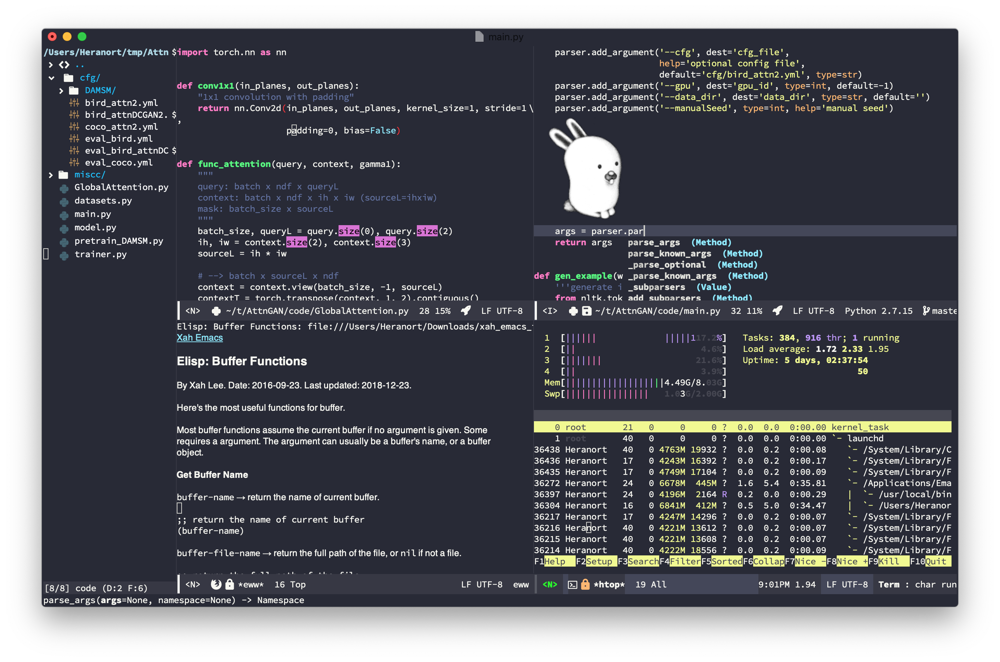

# About M-x bunny
This is M-x bunny, an Emacs editor configuration for my daily use. It features:
1. A cute bunny from [Plan-9](https://9p.io/plan9/) (escaped)!
1. A modified ergonomic keyboard layout based on vim with highlights on fast word/window jumping keys.
2. Fast searching and multi-editing that boosts your productivity.
2. Sleek and fine-tuned UI appearance, from both light and dark side.
3. Fully supported Python workflow, from completion to definition-jumping.
4. Heavy enhancements on eshell which highlights the daemon-client use of Emacs.
# Installation
1. Linux OS or macOS is required.
1. Emacs 26+ is required.
2. Install [Source Code Pro](https://github.com/adobe-fonts/source-code-pro) font.
3. (Optional) Install [Microsoft Python Language Server](https://github.com/emacs-lsp/lsp-python-ms), if you want full-featured Python IDE.
4. Clone this repo
	```bash
	cd ~
	# you may need to delete your .emacs.d directory if exists.
	‌https://github.com/niwtr/M-x-bunny.git .emacs.d
	```
5. Open `bunny-meta.el`, change the `ss-shell-path` to your default path to your shell, and (optional) the ` ss-ms-pyls-executable` to your installed Microsoft Language Server.
6. Make sure you are connected to internet. Open your Emacs and wait for the package installation finishes.
7. Press `<SPC><SPC>`, search for `all-the-icons-install-fonts` to install the required fonts.
# Key bindings
TODO
# Screenshot

# Note
I'm still working on this configuration, consistently applying it to my daily work. It means, everything in this repository may change. If you find this annoying, please switch to another stable configurations. Personally, I recommend [DOOM Emacs](https://github.com/hlissner/doom-emacs).
